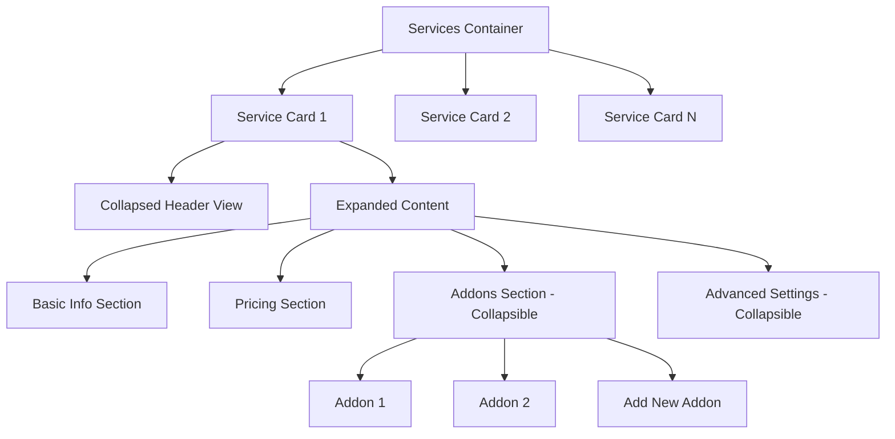

# Design Document: Collapsible Services UI Improvements

## Overview

This design document outlines improvements to the collapsible services interface in the admin dashboard to better handle complex service configurations with addons. The focus is on creating a more organized, manageable interface that prevents page length issues while maintaining usability.

## Architecture

The improved collapsible services interface will use a hierarchical structure:

1. **Service Level**: Main service cards that can expand/collapse
2. **Section Level**: Within expanded services, different configuration areas (basic info, pricing, addons, advanced settings)
3. **Item Level**: Individual addons or configuration items within sections



## Components and Interfaces

### 1. Enhanced Service Card Component

The service card will be restructured to provide better information density and organization:

#### Collapsed State
- Service name and description
- Status indicator (active/inactive)
- Pricing model summary
- Addon count badge
- Quick action buttons (edit, delete, duplicate)

#### Expanded State
- Organized into collapsible subsections
- Smooth animations for expand/collapse
- Independent subsection management

### 2. Collapsible Subsection Component

A reusable component for creating collapsible sections within services:

```javascript
<CollapsibleSection 
  title="Addons Configuration"
  badge={addonCount}
  defaultExpanded={false}
  icon={<PlusIcon />}
>
  {/* Addon configuration content */}
</CollapsibleSection>
```

### 3. Service Overview Component

Enhanced collapsed view showing:
- Service thumbnail/icon
- Key metrics (price range, addon count)
- Status indicators
- Last modified date

### 4. Multi-Service Management

Controls for managing multiple services:
- "Expand All" / "Collapse All" buttons
- Service search/filter functionality
- Bulk actions for multiple services

## Data Models

### Enhanced Service Model

```javascript
{
  id: string,
  name: string,
  description: string,
  status: 'active' | 'inactive' | 'draft',
  pricingModel: string,
  basePrice: number,
  addons: [
    {
      id: string,
      name: string,
      price: number,
      type: 'required' | 'optional',
      category: string
    }
  ],
  advancedSettings: {
    bookingRules: object,
    availability: object,
    customFields: array
  },
  metadata: {
    createdAt: timestamp,
    updatedAt: timestamp,
    addonCount: number
  }
}
```

## User Interface Design

### 1. Collapsed Service Card Layout

```
┌─────────────────────────────────────────────────────────────┐
│ ▶ Service Name                                    [Edit][Del]│
│   Brief description                                          │
│   💰 Fixed Price • 🔧 3 Addons • ✅ Active                  │
└─────────────────────────────────────────────────────────────┘
```

### 2. Expanded Service Card Layout

```
┌─────────────────────────────────────────────────────────────┐
│ ▼ Service Name                                    [Edit][Del]│
│                                                             │
│ ┌─ Basic Information ─────────────────────────────────────┐ │
│ │ Name: [Service Name Input]                              │ │
│ │ Description: [Description Textarea]                     │ │
│ │ Status: [Active/Inactive Toggle]                        │ │
│ └─────────────────────────────────────────────────────────┘ │
│                                                             │
│ ┌─ Pricing Configuration ─────────────────────────────────┐ │
│ │ Model: [Dropdown] Base Price: [Input]                  │ │
│ └─────────────────────────────────────────────────────────┘ │
│                                                             │
│ ▶ Addons Configuration (3 items)                           │
│                                                             │
│ ▶ Advanced Settings                                         │
│                                                             │
└─────────────────────────────────────────────────────────────┘
```

### 3. Expanded Addons Section

```
┌─ ▼ Addons Configuration (3 items) ──────────────────────────┐
│                                                             │
│ ┌─ Addon 1: Extra Service ─────────────────────────────────┐│
│ │ Price: $25 • Optional • [Edit] [Delete]                 ││
│ └─────────────────────────────────────────────────────────┘│
│                                                             │
│ ┌─ Addon 2: Premium Package ───────────────────────────────┐│
│ │ Price: $50 • Required • [Edit] [Delete]                 ││
│ └─────────────────────────────────────────────────────────┘│
│                                                             │
│ [+ Add New Addon]                                           │
└─────────────────────────────────────────────────────────────┘
```

## Implementation Strategy

### 1. State Management

Use React state to manage:
- `expandedServices`: Set of service IDs that are expanded
- `expandedSections`: Map of service ID to expanded section names
- `multiSelectMode`: Boolean for allowing multiple service expansion

### 2. Animation Implementation

Use CSS transitions and React animation libraries:
- Smooth height transitions for expand/collapse
- Fade in/out effects for content
- Staggered animations for multiple items

### 3. Performance Optimization

- Lazy loading of service details when expanded
- Virtual scrolling for large numbers of services
- Memoization of expensive calculations
- Debounced auto-save for configuration changes

## Accessibility Considerations

### 1. Keyboard Navigation
- Tab navigation through collapsible headers
- Enter/Space to expand/collapse sections
- Arrow keys for navigating between services

### 2. Screen Reader Support
- Proper ARIA labels and roles
- Announce state changes (expanded/collapsed)
- Descriptive button labels

### 3. Visual Indicators
- High contrast for expand/collapse indicators
- Clear focus states
- Consistent iconography

## Testing Strategy

### 1. Functionality Testing
- Expand/collapse behavior for single and multiple services
- Nested section management
- Data persistence during expand/collapse operations
- Performance with large numbers of services and addons

### 2. Usability Testing
- User workflow efficiency
- Information findability
- Cognitive load assessment
- Mobile responsiveness

### 3. Accessibility Testing
- Screen reader compatibility
- Keyboard navigation
- Color contrast compliance
- Focus management

## Migration Strategy

### 1. Backward Compatibility
- Maintain existing service data structure
- Gradual rollout of new UI components
- Fallback to current interface if needed

### 2. User Training
- In-app tooltips for new features
- Documentation updates
- Optional guided tour for new collapsible features

## Performance Considerations

### 1. Rendering Optimization
- Only render expanded content when needed
- Use React.memo for service cards
- Implement virtual scrolling for large service lists

### 2. Data Loading
- Lazy load addon details
- Cache frequently accessed service data
- Optimize Firestore queries for service metadata