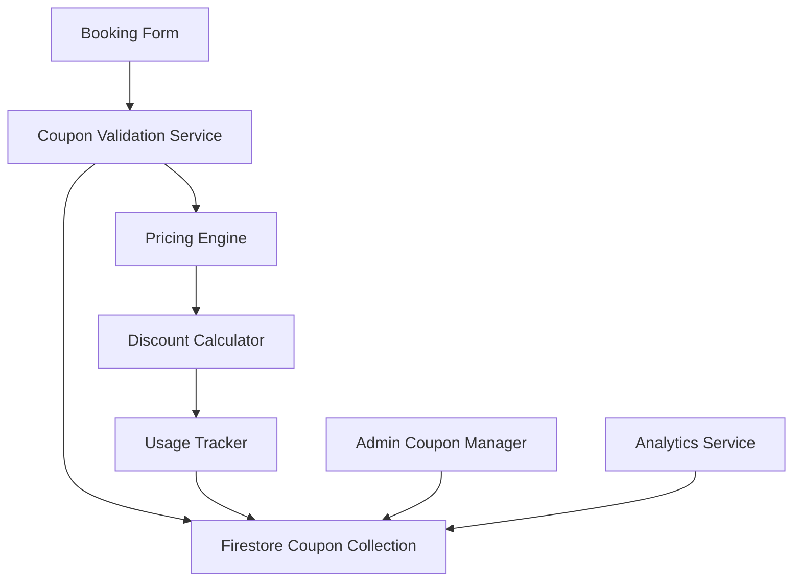

# Coupon Functionality Fix - Design Document

## Overview

This design implements a complete coupon system that integrates with the existing pricing engine and booking flow. The solution consists of a coupon validation service, enhanced pricing engine integration, real-time UI components, and comprehensive admin management tools.

The design follows the existing architectural patterns in the codebase, utilizing Firebase Firestore for data persistence, React components for UI, and the established pricing engine framework for discount calculations.

## Architecture

### System Components



### Data Flow

1. **Coupon Entry**: Customer enters coupon code in booking form
2. **Real-time Validation**: Code is validated against Firestore collection
3. **Discount Calculation**: Valid coupons trigger discount calculation in pricing engine
4. **Price Update**: UI updates with new pricing including discount
5. **Usage Tracking**: Successful bookings increment coupon usage counters
6. **Admin Monitoring**: Administrators can view usage statistics and manage coupons

## Components and Interfaces

### 1. Coupon Validation Service (`utils/couponService.js`)

**Purpose**: Centralized service for all coupon-related operations

**Key Methods**:
```javascript
class CouponService {
  async validateCoupon(companyId, couponCode, bookingData)
  async applyCouponToBooking(companyId, couponCode, bookingId)
  async incrementUsage(companyId, couponId)
  async getCouponUsageStats(companyId, couponId)
  async getActiveCoupons(companyId)
}
```

**Validation Logic**:
- Code format validation (uppercase, alphanumeric)
- Existence check in company's coupon collection
- Expiration date validation
- Usage limit verification
- Service applicability check
- Booking date restrictions

### 2. Enhanced Pricing Engine Integration

**Current Integration Point**: `utils/pricingEngine.js` - `calculateCouponDiscount()` method

**Enhanced Implementation**:
```javascript
async calculateCouponDiscount(amount, couponCode, bookingData) {
  const couponService = new CouponService();
  const validation = await couponService.validateCoupon(
    bookingData.companyId, 
    couponCode, 
    bookingData
  );
  
  if (!validation.isValid) {
    return { discount: 0, error: validation.error };
  }
  
  return this.calculateDiscount(amount, validation.coupon, bookingData);
}
```

**Discount Calculation Logic**:
- Percentage discounts: `amount * (coupon.discountAmount / 100)`
- Fixed discounts: `Math.min(coupon.discountAmount, amount)`
- Service-specific discounts: Apply only to applicable service prices
- Minimum price enforcement: Ensure total never goes below configured minimum

### 3. Real-time Coupon Input Component (`components/CouponInput.jsx`)

**Features**:
- Debounced input validation (300ms delay)
- Real-time feedback with loading states
- Error message display
- Success confirmation with discount preview
- Integration with existing form validation

**State Management**:
```javascript
const [couponState, setCouponState] = useState({
  code: '',
  isValidating: false,
  isValid: false,
  error: null,
  discount: null
});
```

**UI States**:
- Empty: Default input field
- Validating: Loading spinner with "Checking..." message
- Valid: Green checkmark with discount amount
- Invalid: Red error icon with error message
- Applied: Confirmation with discount details

### 4. Enhanced Admin Coupon Management

**Existing Component**: `pages/AdminCouponsPage.jsx`

**Enhancements**:
- Usage statistics display
- Real-time validation during creation
- Bulk operations (activate/deactivate multiple coupons)
- Export functionality for reporting
- Performance analytics dashboard

**New Features**:
- Coupon performance metrics
- Usage trend charts
- Revenue impact analysis
- Customer segmentation by coupon usage

### 5. Booking Form Integration

**Integration Points**:
- `components/EnhancedBookingCalculator.jsx`: Add coupon input to step 3
- Real-time price updates when coupon is applied/removed
- Validation on booking data changes
- Coupon details in booking summary

**User Experience Flow**:
1. Customer enters coupon code in designated field
2. System validates code in real-time
3. Valid codes immediately update pricing display
4. Invalid codes show helpful error messages
5. Booking summary includes coupon details
6. Payment processing includes discount information

## Data Models

### Enhanced Coupon Schema

```javascript
const ENHANCED_COUPON_SCHEMA = {
  // Basic Information
  code: { type: 'string', required: true, maxLength: 20, pattern: /^[A-Z0-9]+$/ },
  name: { type: 'string', required: true, maxLength: 100 },
  description: { type: 'string', maxLength: 500 },
  
  // Discount Configuration
  discountType: { type: 'string', required: true, enum: ['percentage', 'amount'] },
  discountAmount: { type: 'number', required: true, min: 0 },
  
  // Applicability Rules
  appliesTo: { type: 'string', required: true, enum: ['all', 'specific'] },
  selectedServices: { type: 'array', items: 'string' },
  minimumOrderAmount: { type: 'number', min: 0 },
  
  // Validity and Limits
  expiresAt: { type: 'timestamp' },
  doesntExpire: { type: 'boolean', default: false },
  restrictToExpirationDate: { type: 'boolean', default: false },
  usageLimit: { type: 'number', min: 1 },
  limitUsage: { type: 'boolean', default: false },
  currentUsage: { type: 'number', default: 0 },
  
  // Recurring Booking Settings
  canCombineWithRecurring: { type: 'boolean', default: false },
  applyToRecurring: { type: 'string', enum: ['all', 'first'], default: 'all' },
  
  // Status and Metadata
  isActive: { type: 'boolean', default: true },
  createdAt: { type: 'timestamp', required: true },
  updatedAt: { type: 'timestamp', required: true },
  createdBy: { type: 'string', required: true },
  
  // Analytics Fields
  totalRevenueLoss: { type: 'number', default: 0 },
  averageOrderValue: { type: 'number', default: 0 },
  conversionRate: { type: 'number', default: 0 }
};
```

### Coupon Usage Tracking Schema

```javascript
const COUPON_USAGE_SCHEMA = {
  couponId: { type: 'string', required: true },
  couponCode: { type: 'string', required: true },
  bookingId: { type: 'string', required: true },
  customerId: { type: 'string' },
  customerEmail: { type: 'string' },
  
  // Usage Details
  originalAmount: { type: 'number', required: true },
  discountAmount: { type: 'number', required: true },
  finalAmount: { type: 'number', required: true },
  
  // Booking Context
  serviceId: { type: 'string', required: true },
  serviceName: { type: 'string', required: true },
  bookingDate: { type: 'timestamp', required: true },
  
  // Metadata
  usedAt: { type: 'timestamp', required: true },
  ipAddress: { type: 'string' },
  userAgent: { type: 'string' }
};
```

## Error Handling

### Validation Errors

**Coupon Not Found**:
- Message: "Coupon code not found. Please check the code and try again."
- Action: Clear input, allow retry

**Expired Coupon**:
- Message: "This coupon has expired on [date]. Please use a different code."
- Action: Clear input, suggest contacting support

**Usage Limit Exceeded**:
- Message: "This coupon has reached its usage limit. Please try a different code."
- Action: Clear input, suggest alternative offers

**Service Not Applicable**:
- Message: "This coupon is not valid for the selected service."
- Action: Show applicable services or suggest service change

**Minimum Order Not Met**:
- Message: "Minimum order of [amount] required for this coupon."
- Action: Show current total and required amount

### System Errors

**Network Failures**:
- Implement retry logic with exponential backoff
- Show user-friendly "Connection issue" message
- Allow manual retry button

**Database Errors**:
- Log errors for debugging
- Show generic "System temporarily unavailable" message
- Gracefully degrade to no-coupon booking flow

**Rate Limiting**:
- Implement client-side debouncing
- Server-side rate limiting per IP/user
- Clear messaging about temporary restrictions

## Testing Strategy

### Unit Tests

**Coupon Service Tests**:
- Validation logic for all coupon types
- Edge cases (expired, over-limit, invalid format)
- Discount calculation accuracy
- Usage tracking functionality

**Pricing Engine Tests**:
- Integration with coupon service
- Discount application in various scenarios
- Price calculation with multiple discounts
- Minimum price enforcement

**Component Tests**:
- Coupon input component behavior
- Form validation integration
- Real-time feedback functionality
- Error state handling

### Integration Tests

**End-to-End Booking Flow**:
- Complete booking with valid coupon
- Booking attempt with invalid coupon
- Coupon validation during booking modifications
- Payment processing with discounts

**Admin Management Flow**:
- Coupon creation and validation
- Usage statistics accuracy
- Bulk operations functionality
- Export and reporting features

### Performance Tests

**Load Testing**:
- Coupon validation under high concurrent load
- Database query performance with large coupon datasets
- Real-time validation response times
- Memory usage during peak operations

**Security Testing**:
- Brute force protection effectiveness
- SQL injection prevention
- Rate limiting functionality
- Data encryption verification

### User Acceptance Testing

**Customer Experience**:
- Intuitive coupon code entry
- Clear feedback on validation results
- Smooth integration with booking flow
- Mobile responsiveness

**Admin Experience**:
- Efficient coupon management workflow
- Accurate usage reporting
- Performance analytics usefulness
- Bulk operation efficiency

## Security Considerations

### Input Validation
- Sanitize all coupon codes before database queries
- Implement strict format validation (uppercase alphanumeric only)
- Prevent injection attacks through parameterized queries

### Rate Limiting
- Limit coupon validation attempts per IP (10 per minute)
- Implement progressive delays for repeated failures
- Monitor for suspicious patterns and flag for review

### Data Protection
- Encrypt sensitive coupon data at rest
- Use HTTPS for all coupon-related API calls
- Implement proper access controls for admin functions
- Audit trail for all coupon operations

### Fraud Prevention
- Monitor unusual usage patterns
- Implement usage velocity checks
- Flag high-value discount attempts for manual review
- Maintain comprehensive logging for forensic analysis

## Performance Optimization

### Caching Strategy
- Cache frequently accessed coupon data in memory
- Implement Redis caching for high-traffic scenarios
- Use Firestore offline persistence for mobile apps

### Database Optimization
- Index coupon codes for fast lookups
- Partition usage data by date for efficient queries
- Implement database connection pooling

### Frontend Optimization
- Debounce coupon validation requests
- Implement optimistic UI updates
- Use React.memo for coupon-related components
- Lazy load admin analytics components

## Monitoring and Analytics

### Key Metrics
- Coupon validation success rate
- Average response time for validation
- Coupon usage conversion rate
- Revenue impact per coupon campaign

### Alerting
- High error rates in coupon validation
- Unusual spike in coupon usage
- Performance degradation alerts
- Security incident notifications

### Reporting
- Daily/weekly/monthly coupon usage reports
- Revenue impact analysis
- Customer behavior insights
- Campaign effectiveness metrics