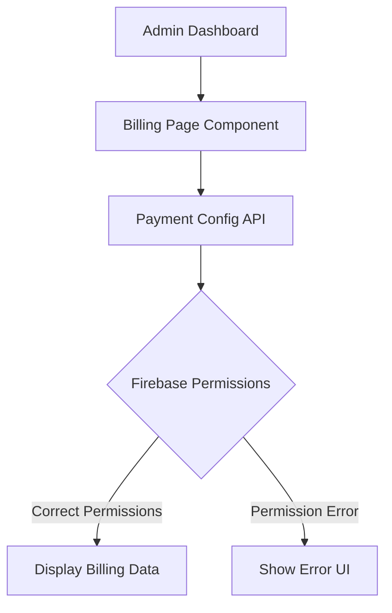
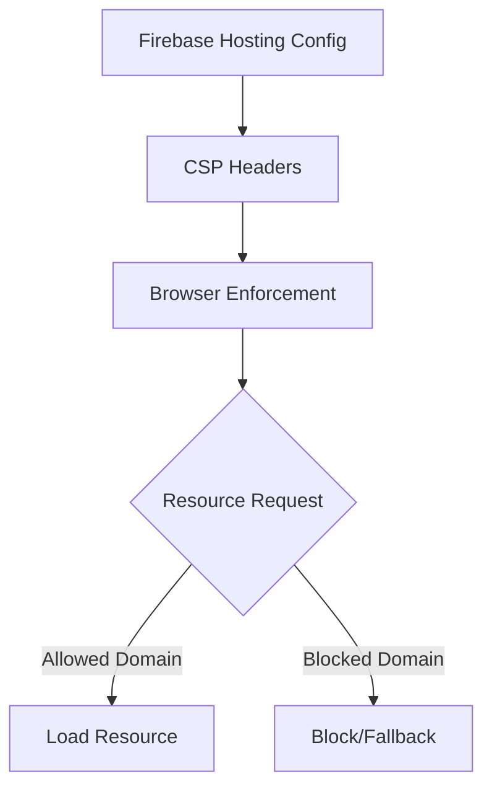
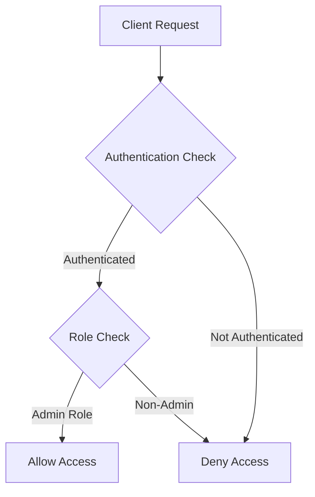
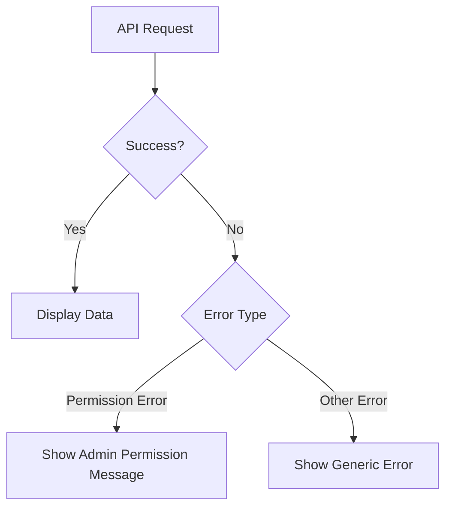

# Design Document: Security Configuration Fixes

## Overview

This design document outlines the approach for addressing the security and configuration issues identified in the requirements document. The primary focus areas are:

1. Content Security Policy (CSP) configuration to allow external images
2. Firebase security rules to fix permission errors, particularly for the admin dashboard billing page
3. Error handling improvements for security-related issues
4. Fixing the blank billing page in the admin dashboard

## Architecture

The application uses a React frontend with Firebase as the backend. The security configuration spans multiple layers:

1. **Browser Layer**: Content Security Policy headers that control what resources can be loaded
2. **Application Layer**: Error handling and UI feedback for security-related issues
3. **Backend Layer**: Firebase security rules that control access to Firestore data

## Components and Interfaces

### 1. Admin Dashboard Billing Page Fix

The blank billing page in the admin dashboard is likely caused by Firebase permission errors when trying to fetch payment configuration data. This will be addressed through:



#### Implementation Details:

- Identify the specific Firestore collection/document that the billing page is trying to access
- Update Firebase security rules to allow admin access to payment/billing collections
- Enhance the billing page component with proper error handling and loading states
- Add fallback UI for when data cannot be loaded

### 2. Content Security Policy Configuration

The CSP needs to be updated to allow images from trusted external domains while maintaining security. This will be implemented through:



#### Implementation Details:

- Update Firebase hosting configuration to include appropriate CSP headers
- Add Unsplash and other required image domains to the `img-src` directive
- Implement fallback mechanisms for blocked images

### 2. Firebase Security Rules

The Firebase security rules need to be updated to allow proper access to payment configuration data for admin users:



#### Implementation Details:

- Update Firestore security rules to check for admin role
- Create proper role-based access control for payment configuration
- Ensure rules follow the principle of least privilege

### 3. Error Handling

Improve error handling for security-related issues to provide better user feedback:



#### Implementation Details:

- Enhance error handling in API request functions
- Create user-friendly error messages for permission issues
- Implement proper error logging for debugging

## Data Models

No new data models are required for this feature. We will be working with existing models:

1. **User Model**: Contains user role information (admin, regular user)
2. **Payment Configuration**: Contains payment settings that admins need to access

## Error Handling

### Permission Errors

For Firebase permission errors:

1. Catch Firebase permission errors in the API request functions
2. Display user-friendly error messages based on the error type
3. Log detailed error information for debugging purposes

Example error handling structure:

```javascript
try {
  const paymentConfig = await fetchPaymentConfig();
  // Process payment config
} catch (error) {
  if (error.code === 'permission-denied') {
    // Show user-friendly message about admin permissions
    displayErrorMessage('You need admin permissions to access payment settings');
  } else {
    // Handle other errors
    displayErrorMessage('An error occurred while loading payment settings');
  }
  // Log for debugging
  console.error('Payment config error:', error);
}
```

### CSP Violation Handling

For CSP violations:

1. Implement image error handling to provide fallbacks for blocked images
2. Monitor CSP violations through reporting mechanisms
3. Create a process for updating CSP when new external resources are needed

## Testing Strategy

### 1. CSP Testing

- Test loading images from approved domains to ensure they display correctly
- Test loading images from non-approved domains to verify blocking behavior
- Verify CSP headers are correctly set in HTTP responses

### 2. Firebase Security Rules Testing

- Test admin user access to payment configuration
- Test non-admin user access to verify proper restrictions
- Test unauthenticated access to ensure security

### 3. Error Handling Testing

- Test error messages for permission denied scenarios
- Verify user-friendly messages are displayed instead of raw error codes
- Test fallback mechanisms for blocked resources

## Implementation Considerations

### CSP Implementation Options

1. **Option 1: Firebase Hosting Headers**
   - Pros: Centralized configuration, applies to all hosted content
   - Cons: Requires deployment to update

2. **Option 2: Server-side Headers (for custom server setups)**
   - Pros: More dynamic control
   - Cons: More complex setup

3. **Option 3: Meta Tag Fallback**
   - Pros: Can be updated without deployment
   - Cons: Less secure than HTTP headers

Recommendation: Use Option 1 (Firebase Hosting Headers) as the primary method, with Option 3 as a fallback for rapid testing.

### Firebase Security Rules Implementation

1. **Role-based Access Control**:
   - Store user roles in Firestore or custom claims
   - Use roles to determine access permissions

2. **Document-level Security**:
   - Restrict access to specific documents based on user roles
   - Use collection group queries where appropriate

Recommendation: Implement role-based access control using custom claims for better performance and security.