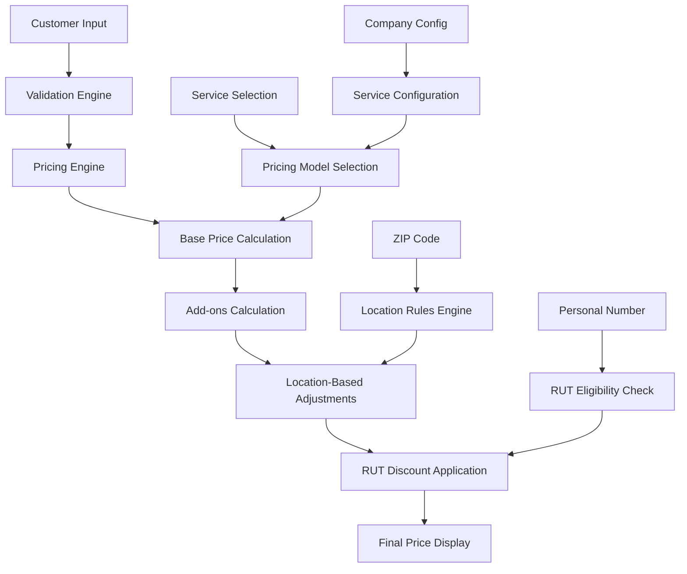

# Form Builder Pricing Engine - Complete Architecture Documentation

## 📋 Table of Contents
- [Overview](#overview)
- [File Structure & Dependencies](#file-structure--dependencies)
- [Core Architecture](#core-architecture)
- [RUT System Integration](#rut-system-integration)
- [ZIP Code Validation & Location-Based Pricing](#zip-code-validation--location-based-pricing)
- [Pricing Models & Service Types](#pricing-models--service-types)
- [Validation Engine Integration](#validation-engine-integration)
- [Real-Time Price Calculation Flow](#real-time-price-calculation-flow)
- [Configuration & Customization](#configuration--customization)
- [Security & Data Validation](#security--data-validation)
- [API Reference](#api-reference)
- [Troubleshooting](#troubleshooting)

## 🎯 Overview

The Form Builder Pricing Engine is a sophisticated multi-layered system designed specifically for Swedish cleaning services. It handles complex pricing scenarios including RUT deductions, location-based pricing, dynamic service configurations, and real-time validation.

### Key Features
- **RUT Integration**: Swedish tax deduction system (30% discount)
- **Location-Based Pricing**: ZIP code specific pricing adjustments
- **Multiple Pricing Models**: Window, per-sqm, per-room, fixed, hourly
- **Dynamic Rules Engine**: Configurable pricing rules
- **Real-Time Validation**: Live form validation and price calculation
- **Multi-Tenant Support**: Company-specific configurations

## 📁 File Structure & Dependencies

```
webapp/src/
├── utils/
│   ├── pricingEngine.js          # Core pricing calculations
│   ├── pricingRulesEngine.js     # Dynamic pricing rules
│   ├── validationEngine.js       # Input validation
│   └── secureLogger.js           # Data sanitization
├── components/
│   ├── formbuilder/
│   │   ├── BookingCalculator.jsx     # Main calculator component
│   │   ├── PriceCard.jsx             # Price display component
│   │   ├── ZipCodeValidationStep.jsx # ZIP code validation
│   │   ├── CustomFormStep.jsx        # Form fields
│   │   ├── ServiceSelectionStep.jsx  # Service selection
│   │   └── ConfigFormStep.jsx        # Service configuration
│   └── EnhancedBookingCalculator.jsx # Advanced calculator
└── crm/ui/FormFields/
    ├── RUTToggle.jsx             # RUT eligibility toggle
    ├── PersonnummerInput.jsx     # Swedish personal number input
    └── AddressInput.jsx          # Address with ZIP validation
```

## 🏗️ Core Architecture

### Architecture Diagram



### Core Components

1. **Pricing Engine** (`pricingEngine.js`)
   - Central calculation logic
   - Multiple pricing models
   - RUT integration
   - Caching system

2. **Rules Engine** (`pricingRulesEngine.js`)
   - Dynamic pricing rules
   - Location-based adjustments
   - Seasonal pricing
   - Promotional discounts

3. **Validation Engine** (`validationEngine.js`)
   - Input validation
   - Business rule validation
   - Real-time feedback

## 🇸🇪 RUT System Integration

### What is RUT?
RUT (Renhållning, Underhåll, Travsport) is a Swedish tax deduction system that allows individuals to deduct 30% of the cost for household services like cleaning.

### Files Involved
- `pricingEngine.js` (lines 325-332, 366-376)
- `RUTToggle.jsx`
- `PersonnummerInput.jsx`
- `BookingCalculator.jsx` (lines 1464-1480)

### RUT Configuration

```javascript
// RUT Configuration Constants
export const RUT_CONFIG = {
  PERCENTAGE: 0.30, // 30% RUT deduction
  MIN_AMOUNT: 0,
  MAX_AMOUNT: 50000 // Annual limit
};
```

### RUT Eligibility Check

```javascript
/**
 * Check if booking is RUT eligible
 */
isRutEligible(bookingData) {
  // Basic RUT eligibility check
  // In production, this would check personal number format and other criteria
  return bookingData.personalNumber && 
         bookingData.personalNumber.length >= 10 && 
         bookingData.personalNumber.length <= 12;
}
```

### RUT Discount Calculation

```javascript
/**
 * Calculate RUT discount amount
 */
calculateRutDiscount(amount) {
  return Math.min(amount * RUT_CONFIG.PERCENTAGE, RUT_CONFIG.MAX_AMOUNT);
}
```

### Personal Number Validation

```javascript
// PersonnummerInput.jsx
const validatePersonnummer = (input) => {
  // Swedish personnummer format: YYYYMMDD-XXXX
  const pattern = /^\d{8}-\d{4}$/;
  return pattern.test(input);
};

const handleChange = (e) => {
  const input = e.target.value;
  
  // Auto-format: add dash after 8 digits
  let formatted = input;
  if (input.length === 8 && !input.includes('-')) {
    formatted = input + '-';
  }
  
  // Only allow digits and dash
  formatted = formatted.replace(/[^\d-]/g, '');
  
  // Limit to 13 characters (YYYYMMDD-XXXX)
  if (formatted.length <= 13) {
    onChange(formatted);
  }
};
```

### RUT Toggle Component

```javascript
// RUTToggle.jsx
const RUTToggle = ({ checked, onChange, isCompany = false, className = "" }) => {
  return (
    <div className={`bg-green-50 p-3 rounded-lg ${className}`}>
      <label className="flex items-center">
        <input
          type="checkbox"
          checked={checked}
          onChange={onChange}
          className="mr-2 h-4 w-4 text-green-600 focus:ring-green-500 border-gray-300 rounded"
        />
        <span className="text-sm font-medium text-green-800">
          RUT/ROT-berättigad
        </span>
      </label>
      <p className="text-xs text-green-600 mt-1">
        {isCompany ? 'ROT för renoveringar' : 'RUT för hemstädning'}
      </p>
    </div>
  );
};
```

### RUT Integration in Price Calculation

```javascript
// BookingCalculator.jsx - RUT Application
if (selectedService.rutEligible && config.rutEnabled && totalPrice > 0 && hasServiceData) {
  // Calculate RUT only on eligible portions
  const rutEligibleTotal = calculatedPrice + addOnsPrice + rutEligibleFees;
  const rutPercentage = config.rutPercentage || 0.5; // Default to 50% if not set
  const rutDiscount = rutEligibleTotal * rutPercentage;
  const finalPrice = rutEligibleTotal - rutDiscount + nonRutEligibleFees;
  
  setFinalPrice(finalPrice);
  setRutApplied(true);
} else {
  setFinalPrice(totalPrice);
  setRutApplied(false);
}
```

## 📍 ZIP Code Validation & Location-Based Pricing

### Files Involved
- `ZipCodeValidationStep.jsx`
- `pricingRulesEngine.js` (lines 281-338)
- `BookingCalculator.jsx` (lines 1160-1165)

### ZIP Code Validation

```javascript
// BookingCalculator.jsx
// Check if zip code validation is enabled
const isZipCodeEnabled = config?.zipAreas && 
                        Array.isArray(config.zipAreas) && 
                        config.zipAreas.length > 0;
```

### ZIP Code Validation Step

```javascript
// ZipCodeValidationStep.jsx
export default function ZipCodeValidationStep({ config, updateConfig, onNext, onPrev }) {
  const [enabled, setEnabled] = useState(!!(config.zipAreas && config.zipAreas.length > 0));

  useEffect(() => {
    if (!enabled) {
      updateConfig({ zipAreas: [] });
    } else if (!config.zipAreas) {
      updateConfig({ zipAreas: [] });
    }
  }, [enabled]);

  return (
    <div className="max-w-xl mx-auto bg-white p-8 rounded shadow">
      <h2 className="text-2xl font-bold mb-6">Enable ZIP Code Validation</h2>
      <div className="mb-6 flex items-center gap-3">
        <Checkbox
          checked={enabled}
          onChange={e => setEnabled(e.target.checked)}
          id="enable-zip-validation"
        />
        <label htmlFor="enable-zip-validation" className="text-lg font-semibold">
          Enable ZIP code validation
        </label>
      </div>
      {enabled && (
        <div className="mb-6">
          <label className="block text-sm font-medium mb-2">
            Allowed ZIP Codes (managed in Settings)
          </label>
          {Array.isArray(config.zipAreas) && config.zipAreas.length > 0 ? (
            <ul className="list-disc pl-6 text-gray-700">
              {config.zipAreas.map(zip => (
                <li key={zip}>{zip}</li>
              ))}
            </ul>
          ) : (
            <div className="text-gray-400">No ZIP codes configured. Edit in Settings.</div>
          )}
        </div>
      )}
    </div>
  );
}
```

### Location-Based Pricing Rules

```javascript
// pricingRulesEngine.js
// Location-based pricing rule handler
this.registerRuleHandler(RULE_TYPES.LOCATION_BASED, (rule, context) => {
  const { conditions, action } = rule;
  const zipCode = context.inputData.zipCode;
  
  if (!zipCode) {
    return { newPrice: context.currentPrice };
  }
  
  // Check location conditions
  const locationRules = conditions.locationRules || [];
  const applicableRule = locationRules.find(locRule => {
    if (locRule.zipCodes && locRule.zipCodes.includes(zipCode)) {
      return true;
    }
    if (locRule.zipRanges) {
      return locRule.zipRanges.some(range => 
        zipCode >= range.start && zipCode <= range.end
      );
    }
    return false;
  });
  
  if (!applicableRule) {
    return { newPrice: context.currentPrice };
  }
  
  let adjustment = 0;
  const adjustmentValue = applicableRule.adjustment || action.value;
  
  switch (action.type) {
    case ACTION_TYPES.PERCENTAGE_MARKUP:
      adjustment = context.currentPrice * (adjustmentValue / 100);
      break;
    case ACTION_TYPES.PERCENTAGE_DISCOUNT:
      adjustment = -context.currentPrice * (adjustmentValue / 100);
      break;
    case ACTION_TYPES.FIXED_MARKUP:
      adjustment = adjustmentValue;
      break;
    case ACTION_TYPES.FIXED_DISCOUNT:
      adjustment = -adjustmentValue;
      break;
  }
  
  return {
    newPrice: context.currentPrice + adjustment,
    appliedAdjustment: adjustment,
    metadata: {
      type: 'location_based',
      zipCode,
      rule: applicableRule,
      adjustment
    }
  };
});
```

## 🏠 Pricing Models & Service Types

### Available Pricing Models

```javascript
export const PRICING_MODELS = {
  WINDOW: 'window',      // Window cleaning (per window type)
  PER_SQM: 'per-sqm',    // Price per square meter
  PER_ROOM: 'per-room',  // Price per room
  FIXED: 'fixed',        // Fixed price
  HOURLY: 'hourly'       // Hourly rate
};
```

### Window Types (Swedish Industry Standard)

```javascript
export const WINDOW_TYPES = {
  0: { name: 'Utan ramar - två sidor', price: 90 },
  1: { name: 'Utan ramar - fyra sidor', price: 90 },
  2: { name: 'Med ramar - två sidor', price: 120 },
  3: { name: 'Med ramar - fyra sidor', price: 120 },
  4: { name: 'Balkongfönster - två sidor', price: 150 },
  5: { name: 'Balkongfönster - fyra sidor', price: 150 },
  6: { name: 'Terrassdörrar - två sidor', price: 200 },
  7: { name: 'Terrassdörrar - fyra sidor', price: 250 }
};
```

### Add-On Prices (Swedish Industry Standard)

```javascript
export const ADDON_PRICES = {
  'Ladder needed': 500,
  'Clean window frames': 500,
  'Karmtvätt': 500,
  'Stege behövs': 500
};
```

### Service Configuration Example

```javascript
{
  "id": "service1",
  "name": "Window Cleaning",
  "pricingModel": "window",
  "tiers": [
    { "min": 1, "max": 50, "price": 3000 },
    { "min": 51, "max": 100, "price": 5000 }
  ],
  "universalRate": 50,
  "windowTypes": [
    { "name": "Typ 1", "price": 60 },
    { "name": "Typ 2", "price": 80 }
  ],
  "hourlyTiers": [
    { "min": 1, "max": 50, "hours": 3 }
  ],
  "hourlyRate": 400,
  "perRoomRates": [
    { "type": "room", "price": 300 },
    { "type": "bathroom", "price": 150 }
  ],
  "minPrice": 700,
  "vatRate": 25,
  "addOns": [
    { "name": "Oven", "price": 500, "rutEligible": true },
    { "name": "Fridge", "price": 500, "rutEligible": false }
  ],
  "frequencyMultipliers": [
    { "label": "Weekly", "multiplier": 1 },
    { "label": "Monthly", "multiplier": 1.4 }
  ],
  "frequencyEnabled": true,
  "rutEligible": true,
  "customFees": [
    { "label": "Travel", "amount": 100, "rutEligible": false },
    { "label": "Key Pickup", "amount": 50, "rutEligible": false }
  ],
  "status": "published"
}
```

### Price Calculation by Model

```javascript
// pricingEngine.js - Base Price Calculation
calculateBookingPrice(bookingData, serviceConfig) {
  let basePrice = 0;
  let breakdown = {};

  // Calculate base service price
  switch (serviceConfig.pricingModel) {
    case PRICING_MODELS.WINDOW: {
      const windowResult = this.calculateWindowPrice(bookingData);
      basePrice = windowResult.total;
      breakdown.windows = windowResult;
      break;
    }

    case PRICING_MODELS.PER_SQM:
      basePrice = this.calculatePerSqmPrice(bookingData, serviceConfig);
      breakdown.area = bookingData.area;
      breakdown.pricePerSqm = serviceConfig.pricePerSqm || 50;
      break;

    case PRICING_MODELS.PER_ROOM:
      basePrice = this.calculatePerRoomPrice(bookingData, serviceConfig);
      breakdown.rooms = bookingData.rooms;
      breakdown.pricePerRoom = serviceConfig.pricePerRoom || 300;
      break;

    case PRICING_MODELS.FIXED:
      basePrice = serviceConfig.fixedPrice || 0;
      breakdown.fixedPrice = basePrice;
      break;

    case PRICING_MODELS.HOURLY:
      basePrice = this.calculateHourlyPrice(bookingData, serviceConfig);
      breakdown.hours = bookingData.hours;
      breakdown.hourlyRate = serviceConfig.hourlyRate || 400;
      break;
  }

  return { basePrice, breakdown };
}
```

## ✅ Validation Engine Integration

### Files Involved
- `validationEngine.js` (lines 363-419)
- `BookingCalculator.jsx` (lines 1231-1274)

### Validation Schema

```javascript
validatePricingInput(inputData) {
  const pricingSchema = {
    'service': [
      { type: VALIDATION_TYPES.REQUIRED, required: true },
      { type: VALIDATION_TYPES.TYPE, type: FIELD_TYPES.OBJECT }
    ],
    'service.id': [
      { type: VALIDATION_TYPES.REQUIRED, required: true },
      { type: VALIDATION_TYPES.TYPE, type: FIELD_TYPES.STRING }
    ],
    'service.pricingModel': [
      { type: VALIDATION_TYPES.REQUIRED, required: true },
      { type: VALIDATION_TYPES.TYPE, type: FIELD_TYPES.STRING }
    ],
    'area': [
      { type: VALIDATION_TYPES.REQUIRED, required: true },
      { type: VALIDATION_TYPES.TYPE, type: FIELD_TYPES.NUMBER },
      { type: VALIDATION_TYPES.RANGE, min: 1, max: 1000 }
    ],
    'rooms': [
      { type: VALIDATION_TYPES.TYPE, type: FIELD_TYPES.INTEGER },
      { type: VALIDATION_TYPES.RANGE, min: 1, max: 50 }
    ],
    'frequency': [
      { type: VALIDATION_TYPES.TYPE, type: FIELD_TYPES.STRING },
      { 
        type: VALIDATION_TYPES.ENUM, 
        values: ['weekly', 'biweekly', 'monthly', 'quarterly', 'yearly'] 
      }
    ],
    'zipCode': [
      { type: VALIDATION_TYPES.TYPE, type: FIELD_TYPES.ZIP_CODE }
    ],
    'addOns': [
      { type: VALIDATION_TYPES.TYPE, type: FIELD_TYPES.ARRAY },
      { 
        type: VALIDATION_TYPES.ARRAY, 
        itemSchema: [
          { type: VALIDATION_TYPES.TYPE, type: FIELD_TYPES.STRING }
        ]
      }
    ],
    'useRut': [
      { type: VALIDATION_TYPES.TYPE, type: FIELD_TYPES.BOOLEAN }
    ],
    'date': [
      { type: VALIDATION_TYPES.TYPE, type: FIELD_TYPES.DATE }
    ]
  };

  return this.validateObject(inputData, pricingSchema);
}
```

### Customer Information Validation

```javascript
validateCustomerInfo(customerInfo) {
  const customerSchema = {
    'name': [
      { type: VALIDATION_TYPES.REQUIRED, required: true },
      { type: VALIDATION_TYPES.TYPE, type: FIELD_TYPES.STRING },
      { type: VALIDATION_TYPES.MIN, min: 2 }
    ],
    'email': [
      { type: VALIDATION_TYPES.REQUIRED, required: true },
      { type: VALIDATION_TYPES.TYPE, type: FIELD_TYPES.EMAIL }
    ],
    'phone': [
      { type: VALIDATION_TYPES.REQUIRED, required: true },
      { type: VALIDATION_TYPES.TYPE, type: FIELD_TYPES.PHONE }
    ],
    'address': [
      { type: VALIDATION_TYPES.TYPE, type: FIELD_TYPES.STRING }
    ],
    'zipCode': [
      { type: VALIDATION_TYPES.TYPE, type: FIELD_TYPES.ZIP_CODE }
    ]
  };

  return this.validateObject(customerInfo, customerSchema);
}
```

## 💰 Real-Time Price Calculation Flow

### Step-by-Step Process

#### 1. Base Price Calculation

```javascript
// BookingCalculator.jsx - Price calculation
useEffect(() => {
  const selectedService = formServices.find(s => s.id === formData.service);
  
  if (selectedService) {
    let calculatedPrice = 0;
    
    // Calculate base price based on service pricing model
    if (selectedService.pricingModel === 'window') {
      // Window cleaning pricing
      const windowTypes = selectedService.windowTypes || [];
      let hasWindowSelection = false;
      windowTypes.forEach((windowType, index) => {
        const quantity = formData[`window_${index}`] || 0;
        calculatedPrice += quantity * (windowType.price || 0);
        if (quantity > 0) hasWindowSelection = true;
      });
      
      // Apply minimum price only if user has selected windows
      if (hasWindowSelection) {
        const minPrice = selectedService.minPrice || 700;
        calculatedPrice = Math.max(calculatedPrice, minPrice);
      }
    } else if (selectedService.pricingModel === 'universal') {
      // Universal rate per sqm
      const area = formData.area || 0;
      if (area > 0) {
        calculatedPrice = area * (selectedService.universalRate || 50);
        // Apply minimum price only if area is entered
        const minPrice = selectedService.minPrice || 1000;
        calculatedPrice = Math.max(calculatedPrice, minPrice);
      }
    } else if (selectedService.pricingModel === 'fixed-tier') {
      // Fixed tier pricing
      const area = formData.area || 0;
      if (area > 0) {
        const tier = selectedService.tiers?.find(t => 
          area >= t.min && area <= t.max
        );
        calculatedPrice = tier?.price || selectedService.minPrice || 1000;
      }
    }
  }
}, [formData, formServices, config]);
```

#### 2. Add-ons Calculation

```javascript
// pricingEngine.js
calculateAddonsPrice(bookingData) {
  const addons = bookingData.addOns || [];
  const result = {
    items: [],
    total: 0,
    rutEligible: 0,
    nonRutEligible: 0
  };

  addons.forEach(addon => {
    const price = ADDON_PRICES[addon] || 0;
    const isRutEligible = this.isAddonRutEligible(addon);
    
    result.items.push({
      name: addon,
      price,
      rutEligible: isRutEligible
    });
    
    result.total += price;
    
    if (isRutEligible) {
      result.rutEligible += price;
    } else {
      result.nonRutEligible += price;
    }
  });

  return result;
}
```

#### 3. Custom Fees Calculation

```javascript
// pricingEngine.js
calculateCustomFees(serviceConfig) {
  const customFees = serviceConfig.customFees || [];
  const result = {
    items: [],
    total: 0,
    rutEligible: 0,
    nonRutEligible: 0
  };

  customFees.forEach(fee => {
    const amount = fee.amount || 0;
    const isRutEligible = fee.rutEligible || false;
    
    result.items.push({
      label: fee.label,
      amount,
      rutEligible: isRutEligible
    });
    
    result.total += amount;
    
    if (isRutEligible) {
      result.rutEligible += amount;
    } else {
      result.nonRutEligible += amount;
    }
  });

  return result;
}
```

#### 4. RUT Discount Application

```javascript
// BookingCalculator.jsx - RUT Application
if (selectedService.rutEligible && config.rutEnabled && totalPrice > 0 && hasServiceData) {
  // Calculate RUT only on eligible portions
  const rutEligibleTotal = calculatedPrice + addOnsPrice + rutEligibleFees;
  const rutPercentage = config.rutPercentage || 0.5; // Default to 50% if not set
  const rutDiscount = rutEligibleTotal * rutPercentage;
  const finalPrice = rutEligibleTotal - rutDiscount + nonRutEligibleFees;
  
  setFinalPrice(finalPrice);
  setRutApplied(true);
} else {
  setFinalPrice(totalPrice);
  setRutApplied(false);
}
```

#### 5. Final Price Display

```javascript
// PriceCard.jsx
const PriceCard = ({ config }) => {
  const { state } = useCalculator();
  const { formData } = state;
  
  // Calculate prices
  const calculatePrices = () => {
    const selectedService = config.services.find(s => s.id === formData.serviceId);
    if (!selectedService) {
      return { original: 0, final: 0, discount: 0 };
    }
    
    let originalPrice = selectedService.basePrice;
    
    // Apply area-based pricing
    if (formData.area) {
      originalPrice *= (formData.area / 100); // Price per 100 sqm
    }
    
    // Add selected add-ons
    if (formData.addOns?.length) {
      const addOnTotal = formData.addOns.reduce((sum, addOnId) => {
        const addOn = selectedService.addOns?.find(a => a.id === addOnId);
        return sum + (addOn?.price || 0);
      }, 0);
      originalPrice += addOnTotal;
    }
    
    // Apply frequency discount
    if (formData.frequency && selectedService.frequencyDiscounts) {
      const discount = selectedService.frequencyDiscounts[formData.frequency] || 0;
      originalPrice *= (1 - discount);
    }
    
    // Calculate RUT discount
    let finalPrice = originalPrice;
    let rutDiscount = 0;
    if (formData.useRut && config.rutEnabled) {
      rutDiscount = originalPrice * (config.rutPercentage || 0.3);
      finalPrice -= rutDiscount;
    }
    
    return {
      original: Math.round(originalPrice),
      final: Math.round(finalPrice),
      discount: Math.round(rutDiscount)
    };
  };
  
  const { original, final, discount } = calculatePrices();
  
  return (
    <div className="bg-white p-6 rounded-lg shadow-lg border">
      <div className="flex items-center justify-between mb-4">
        <h3 className="text-lg font-semibold text-gray-900">Price Summary</h3>
        <CurrencyDollarIcon className="h-6 w-6 text-green-600" />
      </div>
      
      <div className="space-y-3">
        <div className="flex justify-between">
          <span className="text-gray-600">Original Price:</span>
          <span className="font-medium">{formatPrice(original)}</span>
        </div>
        
        {discount > 0 && (
          <div className="flex justify-between text-green-600">
            <span>RUT Discount:</span>
            <span>-{formatPrice(discount)}</span>
          </div>
        )}
        
        <div className="border-t pt-3">
          <div className="flex justify-between text-lg font-bold">
            <span>Final Price:</span>
            <span className="text-green-600">{formatPrice(final)}</span>
          </div>
        </div>
      </div>
    </div>
  );
};
```

## ⚙️ Configuration & Customization

### Company-Level Settings

```javascript
{
  "zipAreas": ["41107", "41121"],     // Allowed ZIP codes
  "rutEnabled": true,                 // Enable RUT deductions
  "rutPercentage": 0.5,              // RUT discount percentage
  "services": [...],                  // Available services
  "pricingRules": [...]              // Custom pricing rules
}
```

### Dynamic Rule Engine

#### Location Rules
```javascript
{
  "type": "LOCATION_BASED",
  "name": "Stockholm Premium Pricing",
  "conditions": {
    "locationRules": [
      {
        "zipCodes": ["11111", "11112", "11113"],
        "adjustment": 15
      }
    ]
  },
  "action": {
    "type": "PERCENTAGE_MARKUP",
    "value": 15
  }
}
```

#### Service Combination Rules
```javascript
{
  "type": "SERVICE_COMBINATION",
  "name": "Window + Interior Cleaning Discount",
  "conditions": {
    "requiredCombinations": [
      {
        "services": ["window_cleaning", "interior_cleaning"]
      }
    ]
  },
  "action": {
    "type": "PERCENTAGE_DISCOUNT",
    "value": 10
  }
}
```

#### Seasonal Rules
```javascript
{
  "type": "SEASONAL",
  "name": "Summer Window Cleaning Premium",
  "conditions": {
    "months": [6, 7, 8],
    "services": ["window_cleaning"]
  },
  "action": {
    "type": "PERCENTAGE_MARKUP",
    "value": 20
  }
}
```

#### Promotional Rules
```javascript
{
  "type": "PROMOTIONAL",
  "name": "New Customer Discount",
  "conditions": {
    "promoCodes": ["NEWCUSTOMER2024"],
    "validFrom": "2024-01-01",
    "validUntil": "2024-12-31"
  },
  "action": {
    "type": "PERCENTAGE_DISCOUNT",
    "value": 25
  }
}
```

## 🛡️ Security & Data Validation

### Data Sanitization

```javascript
// secureLogger.js
export function sanitizeData(data, sensitiveFields = []) {
  const sanitized = { ...data };
  
  sensitiveFields.forEach(field => {
    if (sanitized[field]) {
      sanitized[field] = '***REDACTED***';
    }
  });
  
  return sanitized;
}

// Usage in pricing engine
const sanitizedBookingData = sanitizeData(bookingData, ['personalNumber', 'email']);
logger.debug('Price calculation input', sanitizedBookingData);
```

### Input Validation Layers

1. **Client-side Validation**
   ```javascript
   // Real-time form validation
   const validateField = (field, value) => {
     const rules = validationSchema[field];
     return validationEngine.validateValue(value, rules);
   };
   ```

2. **Service-level Validation**
   ```javascript
   // Business logic validation
   const validateBookingData = (data) => {
     return validationEngine.validatePricingInput(data);
   };
   ```

3. **Database-level Validation**
   ```javascript
   // Firestore security rules
   match /companies/{companyId}/bookings/{bookingId} {
     allow write: if request.auth != null && 
                   request.auth.token.companyId == companyId &&
                   validateBookingData(request.resource.data);
   }
   ```

### Error Handling

```javascript
// errorHandler.js
export const ERROR_TYPES = {
  VALIDATION_ERROR: 'VALIDATION_ERROR',
  PRICING_ERROR: 'PRICING_ERROR',
  RUT_ERROR: 'RUT_ERROR',
  ZIP_CODE_ERROR: 'ZIP_CODE_ERROR'
};

export const ERROR_SEVERITY = {
  LOW: 'LOW',
  MEDIUM: 'MEDIUM',
  HIGH: 'HIGH',
  CRITICAL: 'CRITICAL'
};

export function handlePricingError(error, context) {
  const errorInfo = {
    type: ERROR_TYPES.PRICING_ERROR,
    severity: ERROR_SEVERITY.MEDIUM,
    message: error.message,
    context,
    timestamp: new Date().toISOString()
  };
  
  logger.error('Pricing calculation error', errorInfo);
  
  // Return user-friendly error message
  return {
    error: true,
    message: 'Unable to calculate price. Please check your input and try again.',
    details: process.env.NODE_ENV === 'development' ? error.message : undefined
  };
}
```

## 📚 API Reference

### PricingEngine Class

#### Methods

```javascript
class PricingEngine {
  // Calculate total price for a booking
  calculateBookingPrice(bookingData, serviceConfig)
  
  // Calculate window cleaning price
  calculateWindowPrice(bookingData)
  
  // Calculate per square meter price
  calculatePerSqmPrice(bookingData, serviceConfig)
  
  // Calculate per room price
  calculatePerRoomPrice(bookingData, serviceConfig)
  
  // Calculate hourly price
  calculateHourlyPrice(bookingData, serviceConfig)
  
  // Calculate add-ons price
  calculateAddonsPrice(bookingData)
  
  // Calculate custom fees
  calculateCustomFees(serviceConfig)
  
  // Calculate RUT discount
  calculateRutDiscount(amount)
  
  // Check RUT eligibility
  isRutEligible(bookingData)
  
  // Cache management
  getCachedPrice(cacheKey)
  cachePrice(cacheKey, result)
  clearCache()
  getCacheStats()
}
```

### ValidationEngine Class

#### Methods

```javascript
class ValidationEngine {
  // Validate pricing input
  validatePricingInput(inputData)
  
  // Validate service configuration
  validateServiceConfig(serviceConfig)
  
  // Validate customer information
  validateCustomerInfo(customerInfo)
  
  // Validate individual value
  validateValue(value, rules, allData)
  
  // Validate object against schema
  validateObject(data, schema)
  
  // Sanitize input data
  sanitizeInput(data, schema)
}
```

### PricingRulesEngine Class

#### Methods

```javascript
class PricingRulesEngine {
  // Add new rule
  addRule(rule)
  
  // Remove rule
  removeRule(ruleId)
  
  // Update rule
  updateRule(ruleId, updates)
  
  // Apply rules to context
  applyRules(context)
  
  // Get applicable rules
  getApplicableRules(context)
  
  // Export rules
  exportRules()
  
  // Import rules
  importRules(rulesConfig)
}
```

## 🔧 Troubleshooting

### Common Issues

#### 1. RUT Not Applied
**Problem**: RUT discount is not being calculated
**Solution**: Check the following:
- Personal number format is correct (YYYYMMDD-XXXX)
- RUT toggle is enabled
- Service is marked as RUT eligible
- Company has RUT enabled in settings

```javascript
// Debug RUT eligibility
console.log('RUT Debug:', {
  personalNumber: bookingData.personalNumber,
  rutEnabled: config.rutEnabled,
  serviceRutEligible: selectedService.rutEligible,
  useRut: formData.useRut
});
```

#### 2. ZIP Code Validation Failing
**Problem**: Valid ZIP codes are being rejected
**Solution**: Check company configuration:
- ZIP areas are properly configured
- ZIP code format is correct
- No extra spaces or characters

```javascript
// Debug ZIP validation
console.log('ZIP Debug:', {
  zipCode: formData.zipCode,
  allowedZips: config.zipAreas,
  isEnabled: isZipCodeEnabled
});
```

#### 3. Price Calculation Errors
**Problem**: Prices are not calculating correctly
**Solution**: Check service configuration:
- Pricing model is set correctly
- Base prices are configured
- Add-ons are properly defined

```javascript
// Debug price calculation
console.log('Price Debug:', {
  service: selectedService,
  formData,
  calculatedPrice,
  breakdown
});
```

#### 4. Validation Errors
**Problem**: Form validation is failing
**Solution**: Check validation schema:
- Required fields are filled
- Data types are correct
- Value ranges are within limits

```javascript
// Debug validation
const validation = validationEngine.validatePricingInput(inputData);
console.log('Validation Debug:', validation);
```

### Performance Optimization

#### 1. Caching
```javascript
// Enable caching for repeated calculations
const cacheKey = pricingEngine.generateCacheKey(bookingData, serviceConfig);
const cachedResult = pricingEngine.getCachedPrice(cacheKey);

if (cachedResult) {
  return cachedResult;
}

const result = pricingEngine.calculateBookingPrice(bookingData, serviceConfig);
pricingEngine.cachePrice(cacheKey, result);
```

#### 2. Debouncing
```javascript
// Debounce price calculations to avoid excessive calls
useEffect(() => {
  const debounceTimer = setTimeout(() => {
    calculatePrice();
  }, 300);

  return () => clearTimeout(debounceTimer);
}, [calculatePrice]);
```

#### 3. Lazy Loading
```javascript
// Load pricing rules only when needed
const loadPricingRules = async () => {
  if (!pricingRulesLoaded) {
    const rules = await fetchPricingRules(companyId);
    rulesEngine.importRules(rules);
    setPricingRulesLoaded(true);
  }
};
```

### Monitoring & Logging

```javascript
// Add comprehensive logging
logger.info('Price calculation started', {
  serviceId: selectedService.id,
  pricingModel: selectedService.pricingModel,
  hasRut: formData.useRut,
  zipCode: formData.zipCode
});

logger.debug('Price calculation result', {
  originalPrice,
  finalPrice,
  rutDiscount,
  appliedRules: rulesResult.appliedRules
});
```

---

## 📝 Version History

- **v2.0** - Added comprehensive RUT integration and location-based pricing
- **v1.5** - Enhanced validation engine and error handling
- **v1.0** - Initial release with basic pricing models

## 🤝 Contributing

When contributing to the pricing engine:

1. Follow the existing code structure
2. Add comprehensive tests for new features
3. Update this documentation
4. Ensure backward compatibility
5. Add proper error handling and logging

## 📄 License

This pricing engine is part of the SwedPrime application and follows the same licensing terms.
