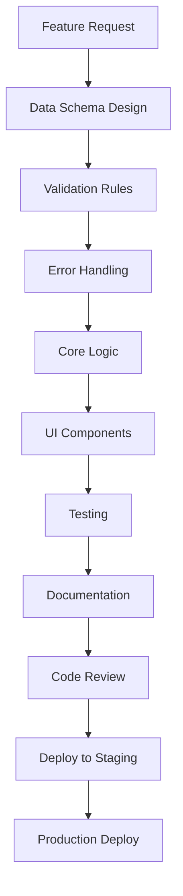

# Development Workflow for SwedPrime

## 🎯 **Systematic Development Approach**

### **Core Principles**
1. **Data-First Design**: Start with data schemas and validation
2. **Error-Handling First**: Implement error handling before features
3. **Testing-Driven**: Write tests for critical business logic
4. **Documentation-Driven**: Document as you code
5. **Security-First**: Validate and sanitize all data

## 📋 **Development Process**

### **1. Feature Development Workflow**



### **2. Step-by-Step Process**

#### **Step 1: Data Schema Design**
```javascript
// 1. Define data structure in dataSchemas.js
export const NEW_FEATURE_SCHEMA = {
  field1: { type: 'string', required: true, maxLength: 100 },
  field2: { type: 'number', required: false, min: 0 },
  // ... other fields
};

// 2. Add validation functions
export function validateNewFeature(data) {
  return validateData(data, NEW_FEATURE_SCHEMA);
}
```

#### **Step 2: Error Handling**
```javascript
// 1. Define error types in errorHandler.js
export const ERROR_TYPES = {
  // ... existing types
  NEW_FEATURE_ERROR: 'NEW_FEATURE_ERROR'
};

// 2. Add error messages
export const ERROR_MESSAGES = {
  // ... existing messages
  [ERROR_TYPES.NEW_FEATURE_ERROR]: {
    title: 'Feature Error',
    message: 'Feature operation failed',
    userMessage: 'Kunde inte utföra åtgärden. Försök igen.'
  }
};
```

#### **Step 3: Core Logic**
```javascript
// 1. Create service layer
// services/newFeatureService.js
export class NewFeatureService {
  static async createFeature(data) {
    try {
      // Validate data
      const errors = validateNewFeature(data);
      if (errors.length > 0) {
        throw new ValidationError(errors);
      }

      // Sanitize data
      const sanitizedData = sanitizeData(data, NEW_FEATURE_SCHEMA);

      // Add timestamps
      const featureData = {
        ...sanitizedData,
        createdAt: serverTimestamp(),
        updatedAt: serverTimestamp()
      };

      // Save to Firestore
      const docRef = await addDoc(collection(db, 'features'), featureData);
      
      logger.info('Feature created successfully', { id: docRef.id });
      return { id: docRef.id, ...featureData };
      
    } catch (error) {
      errorHandler.handleError(error, {
        operation: 'createFeature',
        data
      });
      throw error;
    }
  }
}
```

#### **Step 4: UI Components**
```javascript
// 1. Create component with error handling
// components/NewFeatureForm.jsx
import { errorHandler } from '../utils/errorHandler.js';
import { NewFeatureService } from '../services/newFeatureService.js';

export default function NewFeatureForm() {
  const [loading, setLoading] = useState(false);
  const [error, setError] = useState(null);

  const handleSubmit = async (formData) => {
    setLoading(true);
    setError(null);
    
    try {
      await NewFeatureService.createFeature(formData);
      toast.success('Feature skapad framgångsrikt!');
    } catch (error) {
      setError(error.message);
      // Error is already handled by service layer
    } finally {
      setLoading(false);
    }
  };

  return (
    <form onSubmit={handleSubmit}>
      {/* Form fields */}
      {error && <div className="error">{error}</div>}
      <button type="submit" disabled={loading}>
        {loading ? 'Sparar...' : 'Skapa'}
      </button>
    </form>
  );
}
```

#### **Step 5: Testing**
```javascript
// 1. Unit tests for validation
// tests/validation.test.js
describe('NewFeature Validation', () => {
  test('should validate required fields', () => {
    const data = { field1: 'test' };
    const errors = validateNewFeature(data);
    expect(errors).toHaveLength(0);
  });

  test('should reject invalid data', () => {
    const data = { field1: '' };
    const errors = validateNewFeature(data);
    expect(errors).toContain('field1 is required');
  });
});

// 2. Integration tests for service
// tests/services/newFeatureService.test.js
describe('NewFeatureService', () => {
  test('should create feature successfully', async () => {
    const data = { field1: 'test', field2: 100 };
    const result = await NewFeatureService.createFeature(data);
    expect(result.id).toBeDefined();
    expect(result.field1).toBe('test');
  });
});
```

## 🔧 **Code Quality Standards**

### **1. File Organization**
```
src/
├── components/          # React components
│   ├── ui/             # Reusable UI components
│   └── features/       # Feature-specific components
├── services/           # Business logic services
├── utils/              # Utility functions
│   ├── dataSchemas.js  # Data validation schemas
│   ├── errorHandler.js # Error handling
│   └── pricingEngine.js # Pricing logic
├── pages/              # Page components
├── context/            # React context
└── firebase/           # Firebase configuration
```

### **2. Naming Conventions**
```javascript
// Files: PascalCase for components, camelCase for utilities
// NewFeatureForm.jsx, pricingEngine.js

// Components: PascalCase
export default function NewFeatureForm() {}

// Functions: camelCase
export function calculatePrice() {}

// Constants: UPPER_SNAKE_CASE
export const MAX_RETRY_ATTEMPTS = 3;

// Variables: camelCase
const featureData = {};
```

### **3. Import Organization**
```javascript
// 1. External libraries
import React, { useState, useEffect } from 'react';
import { useNavigate } from 'react-router-dom';

// 2. Internal utilities
import { errorHandler } from '../utils/errorHandler.js';
import { validateData } from '../utils/dataSchemas.js';

// 3. Services
import { NewFeatureService } from '../services/newFeatureService.js';

// 4. Components
import { Button } from '../components/ui/Button.jsx';
```

## 🧪 **Testing Strategy**

### **1. Test Categories**
```javascript
// Unit Tests: Individual functions
describe('Pricing Engine', () => {
  test('should calculate window price correctly', () => {
    const result = pricingEngine.calculateWindowPrice({
      window_0: 1,
      window_1: 2
    });
    expect(result.total).toBe(270); // 90 + (90 * 2)
  });
});

// Integration Tests: Service interactions
describe('Booking Service', () => {
  test('should create booking with pricing', async () => {
    const bookingData = { /* test data */ };
    const result = await BookingService.createBooking(bookingData);
    expect(result.totalPrice).toBeGreaterThan(0);
  });
});

// E2E Tests: User workflows
describe('Booking Flow', () => {
  test('should complete booking process', async () => {
    // Test complete user journey
  });
});
```

### **2. Test Data Management**
```javascript
// tests/fixtures/testData.js
export const TEST_BOOKING_DATA = {
  customerName: 'Test Customer',
  customerEmail: 'test@example.com',
  window_0: 1,
  window_1: 2,
  addon_Ladder_needed: true
};

export const TEST_SERVICE_CONFIG = {
  pricingModel: 'window',
  minPrice: 900,
  windowTypes: WINDOW_TYPES
};
```

## 🔒 **Security Checklist**

### **1. Data Validation**
- [ ] All inputs validated against schemas
- [ ] Data sanitized before storage
- [ ] Type checking implemented
- [ ] Length limits enforced

### **2. Error Handling**
- [ ] No sensitive data in error messages
- [ ] Proper error logging implemented
- [ ] User-friendly error messages
- [ ] Graceful degradation

### **3. Firebase Security**
- [ ] Security rules deployed
- [ ] Tenant isolation verified
- [ ] Role-based access implemented
- [ ] Data validation in rules

## 📊 **Performance Guidelines**

### **1. Query Optimization**
```javascript
// ✅ Good: Use indexes
const q = query(
  collection(db, 'bookings'),
  where('companyId', '==', companyId),
  orderBy('createdAt', 'desc'),
  limit(20)
);

// ❌ Avoid: Complex queries without indexes
const q = query(
  collection(db, 'bookings'),
  where('companyId', '==', companyId),
  where('status', '==', 'pending'),
  where('totalPrice', '>', 1000) // Requires composite index
);
```

### **2. Caching Strategy**
```javascript
// Cache frequently accessed data
const useCachedData = (key, fetchFn, ttl = 5 * 60 * 1000) => {
  const [data, setData] = useState(null);
  const [loading, setLoading] = useState(true);

  useEffect(() => {
    const cached = localStorage.getItem(key);
    if (cached) {
      const { data: cachedData, timestamp } = JSON.parse(cached);
      if (Date.now() - timestamp < ttl) {
        setData(cachedData);
        setLoading(false);
        return;
      }
    }

    fetchFn().then(result => {
      setData(result);
      localStorage.setItem(key, JSON.stringify({
        data: result,
        timestamp: Date.now()
      }));
      setLoading(false);
    });
  }, [key]);

  return { data, loading };
};
```

## 🚀 **Deployment Process**

### **1. Staging Deployment**
```bash
# 1. Run tests
npm run test

# 2. Build for staging
npm run build:staging

# 3. Deploy to staging
firebase deploy --project staging-project

# 4. Run staging tests
npm run test:e2e:staging
```

### **2. Production Deployment**
```bash
# 1. Merge to main branch
git checkout main
git merge feature/new-feature

# 2. Run full test suite
npm run test:all

# 3. Build for production
npm run build

# 4. Deploy to production
firebase deploy --project production-project

# 5. Verify deployment
npm run health-check
```

### **3. Rollback Process**
```bash
# If issues detected
git revert HEAD
firebase deploy --project production-project
```

## 📝 **Documentation Standards**

### **1. Code Documentation**
```javascript
/**
 * Calculate total price for a booking
 * @param {Object} bookingData - The booking data
 * @param {Object} serviceConfig - The service configuration
 * @returns {Object} Price breakdown with total
 * @throws {ValidationError} If data is invalid
 * @throws {PricingError} If calculation fails
 */
calculateBookingPrice(bookingData, serviceConfig) {
  // Implementation
}
```

### **2. API Documentation**
```javascript
// Document all service methods
export class BookingService {
  /**
   * Create a new booking
   * 
   * @param {string} companyId - Company ID
   * @param {Object} bookingData - Booking data
   * @returns {Promise<Object>} Created booking
   * 
   * @example
   * const booking = await BookingService.createBooking('company123', {
   *   customerName: 'John Doe',
   *   window_0: 1,
   *   totalPrice: 995
   * });
   */
  static async createBooking(companyId, bookingData) {
    // Implementation
  }
}
```

## 🔄 **Code Review Process**

### **1. Review Checklist**
- [ ] Data validation implemented
- [ ] Error handling added
- [ ] Tests written and passing
- [ ] Documentation updated
- [ ] Performance considered
- [ ] Security reviewed
- [ ] Code follows conventions

### **2. Review Template**
```markdown
## Code Review

### ✅ What's Good
- [List positive aspects]

### ⚠️ Issues Found
- [List issues with severity]

### 🔧 Suggestions
- [List improvement suggestions]

### 📋 Action Items
- [ ] [Action item 1]
- [ ] [Action item 2]

### 🚀 Ready for Merge?
- [ ] All issues resolved
- [ ] Tests passing
- [ ] Documentation updated
```

## 🎯 **Quality Gates**

### **1. Pre-commit Checks**
```bash
# Run before every commit
npm run lint
npm run test:unit
npm run type-check
```

### **2. Pre-deploy Checks**
```bash
# Run before deployment
npm run test:all
npm run build
npm run security-check
npm run performance-check
```

### **3. Post-deploy Verification**
```bash
# Run after deployment
npm run health-check
npm run smoke-tests
npm run performance-monitor
```

This systematic workflow ensures **consistent**, **reliable**, and **maintainable** code development for the Swedish cleaning industry complexity. 